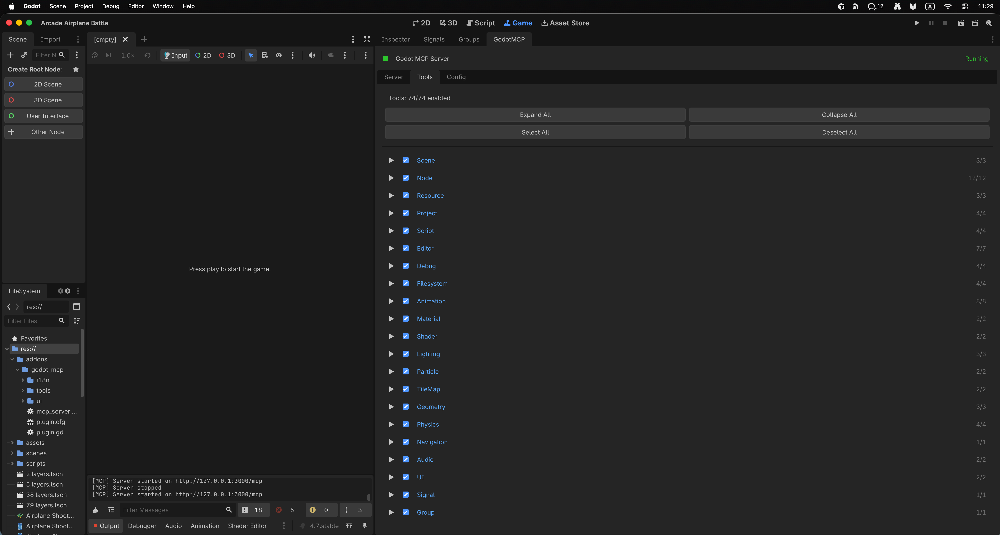
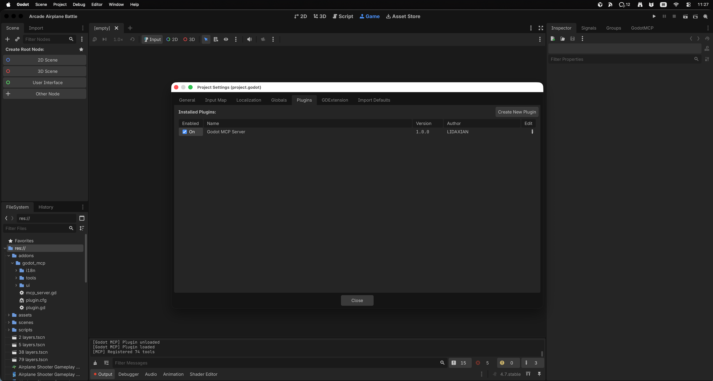
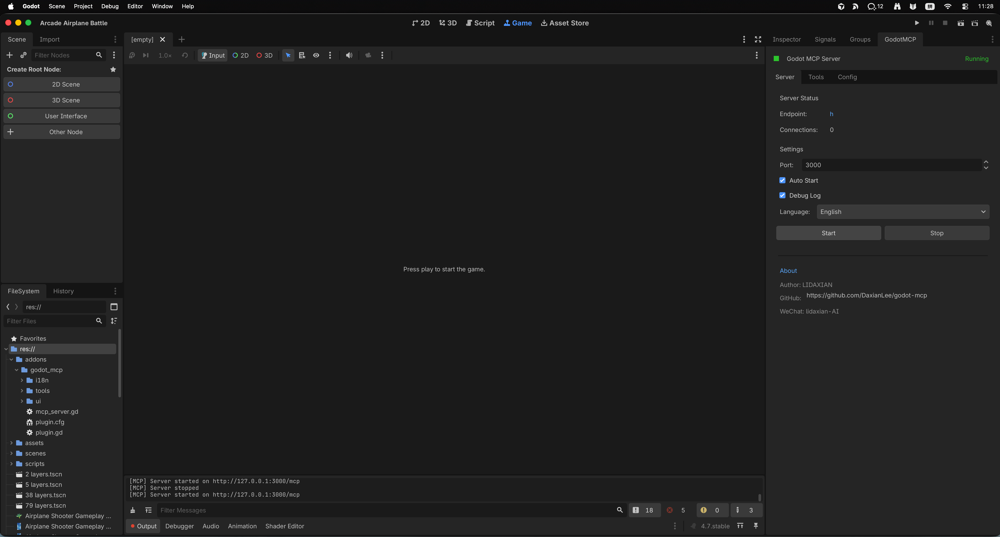
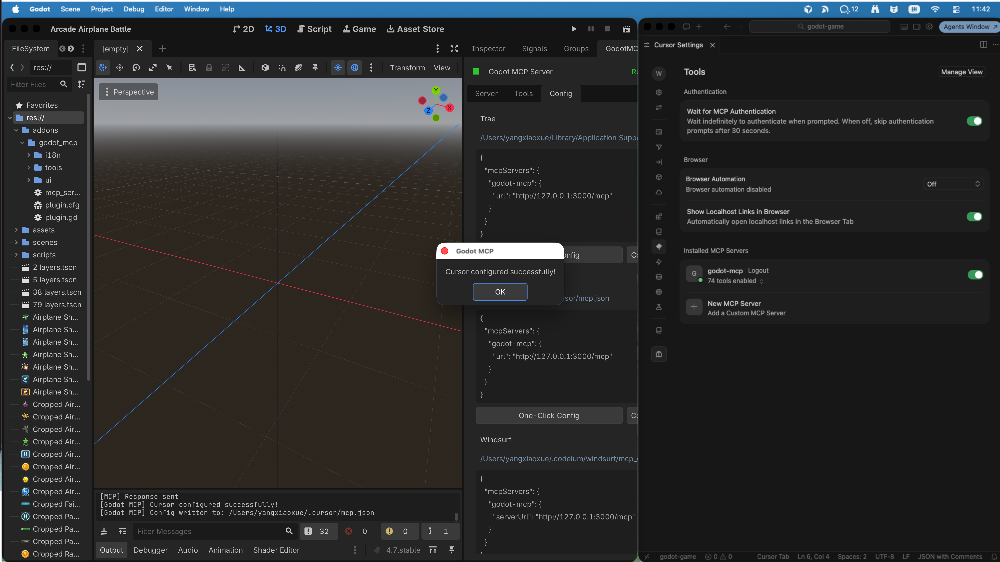

# Godot MCP (Server-Sent Events) - Cursor, Claude and Windsurf Connector

English | [中文](./README_zh.md)

[](https://github.com/DaxianLee/godot-mcp)
[](https://github.com/DaxianLee/godot-mcp)
[](https://godotengine.org)
[](https://modelcontextprotocol.io/)
[](https://opensource.org/licenses/MIT)
[](https://www.vberai.com)

An out-of-the-box, **zero-dependency** Model Context Protocol (MCP) server integration designed specifically for the **Godot Engine (4.x)**.

> **📢 Notice on Organization Migration & Trust**
>
> This repository (`vberai/godot-mcp`) is the **official organizational home** of the highly popular `godot-mcp` plugin, originally created by our co-founder and lead developer [@DaxianLee (Original repository: DaxianLee/godot-mcp, trusted by 460+ stars and 50+ forks)](https://github.com/DaxianLee/godot-mcp). 
> 
> We have migrated active development here under the **VberAI** brand to ensure long-term maintenance, continuous feature upgrades (such as multi-IDE one-click setup helpers), and deeper engine integrations. **It is and will always remain 100% free and open-source!**

---

## ✨ Zero-Dependency & Built-in GUI Setup

Most MCP plugins force you to install Node.js/NPM, compile TS files, and configure terminal routers. `godot-mcp` works differently:

*   **Zero CLI Friction**: Runs entirely inside your Godot Editor via a lightweight built-in HTTP server.
*   **One-Click IDE Configuration**: Includes an in-editor docking panel that can instantly write configuration files for **Cursor** or **Trae** with a single click, or copy the exact CLI installation config strings for **Claude Desktop / Claude Code**.
*   **Visual Control Hub**: Switch tools, monitor local server live-logs, and control connection ports (Default: `3000`) directly within Godot's UI interface.

```text
┌────────────────────────────────────────────────────────┐
│ [ Godot Editor Panel ]                                 │
│ ┌───────────────┐ ┌────────────────┐ ┌───────────────┐ │
│ │  Server Logs  │ │  Tools Status  │ │  Config (IDE) │ │
│ ├───────────────┴ └────────────────┴ ───────────────┤ │
│ │  Host IP: 127.0.0.1      [Start Server] [Stop]     │ │
│ │  Selected IDE: [ Cursor / Trae / Claude Desktop ] │ │
│ │  >> [ONE-CLICK CONFIG] <<                          │ │
│ └────────────────────────────────────────────────────┘ │
└────────────────────────────────────────────────────────┘
```

---

## 🧰 Supported MCP Tools (API Registry)

Once connected, your AI agents (Claude, Cursor, Trae, ChatGPT) gain access to a powerful set of tools to interact with your active Godot project directory. The server exposes the following functions:

<p align="center">
  
</p>

### 📁 Workspace & Scene Management
*   `scene_create(path, root_node_type)`: Generates a new `.tscn` scene resource programmatically.
*   `scene_open(path)`: Automatically opens, matches, and focuses the viewport on a target scene in the editor.
*   `scene_save()`: Triggers a live-saving event of the current working scene.
*   `get_scene_tree(path)`: Exposes the full, parsed node tree structure of a target scene to the LLM context.
*   `get_scene_info(path)`: Returns metadata, external dependencies (resources), and inspector details of a scene.

### 📝 Script Refactoring & Editing
*   `read_gdscript(path)`: Safely loads any `.gd` file into the AI's window for inspection.
*   `write_gdscript(path, code)`: Writes or modifies full GDScript code, fully supported with auto-formatting and syntax validation.
*   `modify_gdscript(path, modifications)`: Appends, replaces, or structures specific blocks of an active GDScript without rewriting the entire file.

### ⚙️ Engine State & Execution
*   `get_godot_state()`: Fetches global editor context, window structures, selected nodes, and active build options.
*   `execute_editor_command(command)`: Allows the agent to instruct the parent system to build project files, compile assets, or run/stop the active game scene.

---

## 🎬 Demo

<p align="center">
  
</p>

---

## ⚡ Quick Start (60-Second Setup)

### 1. Enable the Godot Addon
1. Copy the `addons/godot_mcp` folder into your Godot project's `res://addons/` directory.
2. In Godot, navigate to **Project -> Project Settings -> Plugins** and check the **Enable** box for **Godot MCP Server**.

<p align="center">
  
</p>

### 2. Start the MCP Server
1. Open the **GodotMCP** panel in the editor dock.
2. Click **Start Server** and confirm the server is running on port `3000`.

<p align="center">
  
</p>

### 3. Live Setup Your Favorite Client

#### Option A: Cursor / Trae (Dynamic Built-in Panel Setup)
1. Locate the **GodotMCP** panel on your editor docks (usually bottom-right or right panel).
2. Go to the **Config** tab.
3. Click **One-Click Config**. The plugin will locate your local IDE configuration files and register the server block instantly.

<p align="center">
  
</p>

#### Option B: Claude Desktop Configuration
Copy the configuration below to your `claude_desktop_config.json` manually if desired:
```json
{
  "mcpServers": {
    "godot-mcp": {
      "command": "curl",
      "args": ["-s", "http://127.0.0.1:3000/mcp"],
      "transport": "http"
    }
  }
}
```

---

## 🌐 The VberAI Ecosystem

While **Godot MCP** is 100% free and open-source under the MIT license, we specialize in building professional AI-native game design environments. If you are developing on other platforms or need enterprise-class automated workspaces, explore our customized pro-grade engines:

| Engine / Suite | Product | License / Edition | Details & Store |
| :--- | :--- | :--- | :--- |
| **Godot Engine** | **Godot MCP** | 🟢 **Open-Source (MIT)** | Free forever, community-driven workflow |
| **Unity Engine** | **Unity MCP Pro** | 🟡 Commercial | Custom memory routing, specialized agent bindings |
| **Cocos Creator**| **Cocos MCP Pro** | 🟡 Commercial | Optimizations for Web, H5, and WeChat Mini-games |
| **VberAI Studio** | **VberAI Studio (SaaS)** | 💎 Subscription | Complete agent-native studio managing assets & design |

Learn more and start your free trials at [vberai.com](https://www.vberai.com).

---

## 🤝 Support & Development

We highly encourage community bug reports and pull requests! 
*   If you encounter an issue or want to suggest new Godot API tools, please open an [Issue](https://github.com/vberai/godot-mcp/issues).
*   For corporate inquires and licensing regarding Cocos/Unity products, email us at: info [at] vberai.com.

---

## 📄 License

This repository is licensed under the MIT License - see the [LICENSE](LICENSE) file for details.

<p align="center">
  
  
  <a href="https://vberai.com"></a>
  <a href="https://t.me/+8618827755984"></a>
</p>
