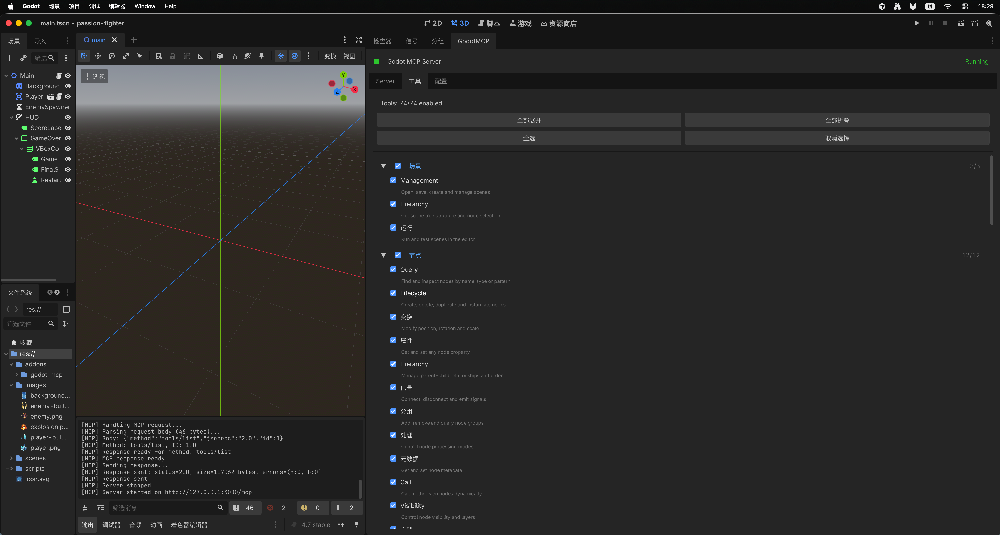
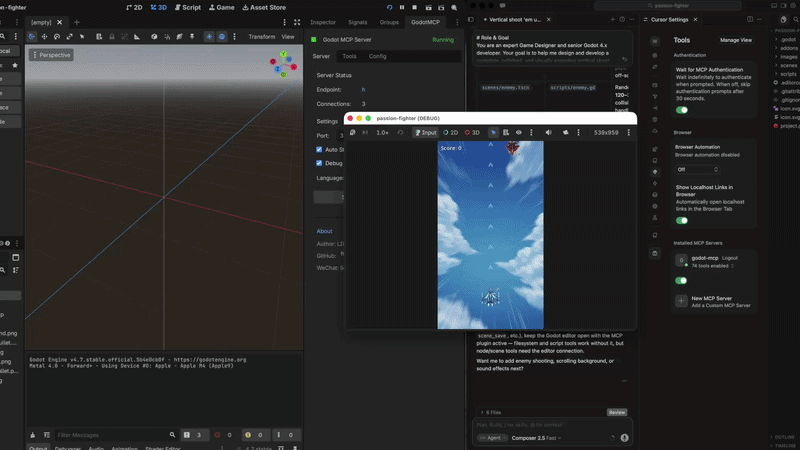
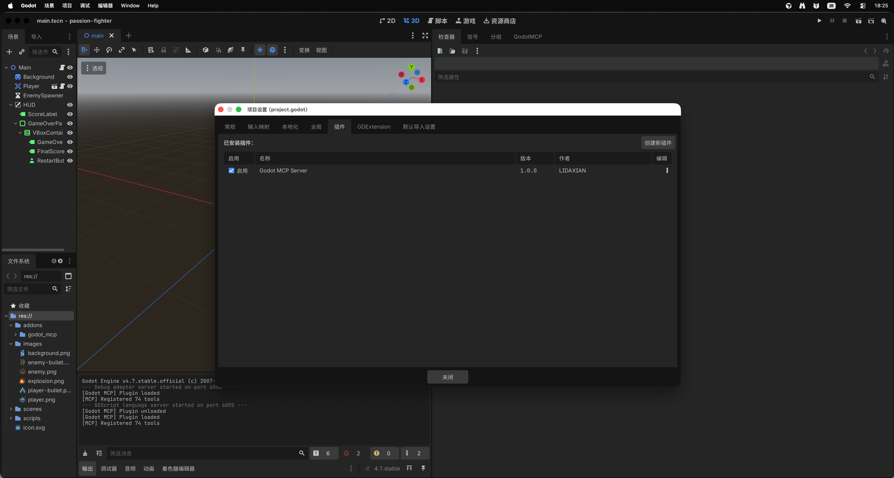
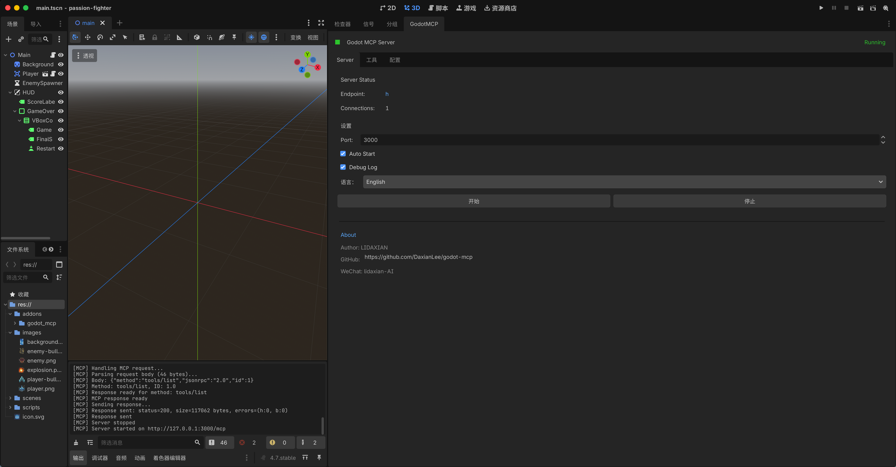
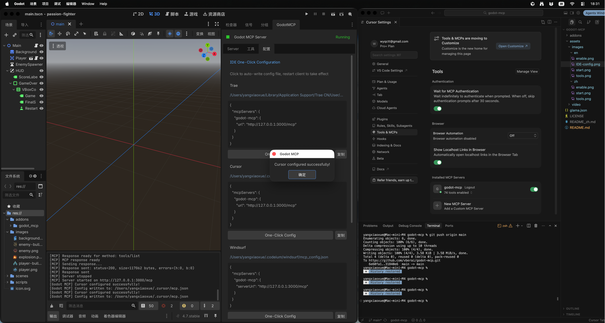

# Godot MCP (Server-Sent Events) - Cursor, Claude 与 Windsurf 官方桥接插件

[English](./README.md) | 中文

<p align="center">
  
  
  <a href="https://vberai.com"></a>
  <a href="https://t.me/+8618827755984"></a>
</p>

本仓库是由 **VberAI 团队** 官方维护并持续优化的 **Godot-MCP 尊享版 Fork 分支**（原案技术源自优秀开源项目 `DaxianLee/godot-mcp`）。

通过本插件，你可以在不安装任何 Node.js、C# 编译器等繁琐环境的前提下，实现 **Cursor、Claude Desktop、Windsurf** 等现代 AI 编辑器直接**无感读写并修改你 Godot 4.x 项目的场景树、挂载脚本以及自动拼 UI 布局**。

---

## ⚡ 为什么选择这个官方优化的 Fork 版本？
- **100% 纯 GDScript 实现**：无 Node.js 构建，没有 TypeScript 依赖，更不需要 .NET Mono 环境，扔进项目即用！
- **极速本地连接**：基于标准 SSE 协议构建。绝不向公网暴露数据，完全本地运行在本地回环 IP（`127.0.0.1:3000/mcp`），代码资产绝对安全。
- **与原仓库自动保持同步**：原开源项目一旦修复 Bug，VberAI 都会第一时间合并更新，保障你使用的永远是体验最好的最新版本。

---

## 🧰 MCP 插件支持的工具

<p align="center">
  
</p>

---

## 🎬 演示效果

<p align="center">
  
</p>

---

## 🚀 极速起步（只需一分钟）

### 1. 简易安装
将本仓库根目录下的 `addons/godot_mcp` 文件夹，直接克隆或复制到你的 Godot 项目根目录下。进入 `项目 -> 项目设置 -> 插件`，勾选启用 **Godot MCP**。

<p align="center">
  
</p>

### 2. 启动 MCP 服务
1. 在编辑器停靠栏打开 **GodotMCP** 面板。
2. 点击 **Start Server**，确认服务在 `3000` 端口运行。

<p align="center">
  
</p>

### 3. 在 AI 客户端中完成连接配置

#### 方式 A：Godot 编辑器内一键配置（推荐）
1. 打开 **GodotMCP** 面板的 **Config** 标签页。
2. 选择目标 IDE（Cursor / Trae 等），点击 **One-Click Config**。

<p align="center">
  
</p>

#### 方式 B：在 Cursor 编辑器中手动配置
进入 Cursor 的 `Settings -> Features -> MCP`。点击 **+ Add New MCP Server**：
- **Name**: `godot-mcp`
- **Type**: `sse`
- **URL**: `http://127.0.0.1:3000/mcp`

#### 方式 C：在 Claude Desktop (Mac / Windows 客户端) 中手动配置
在你的 `claude_desktop_config.json` 配置文件中写入：
```json
{
  "mcpServers": {
    "godot-mcp": {
      "command": "curl",
      "args": ["-N", "http://127.0.0.1:3000/mcp"]
    }
  }
}
```

---

## 🎨 走出 Godot：你是否同时在使用 Unity、Cocos Creator？
作为一家深耕 **"AI 原生游戏生产力工具"** 的专业团队，开源的 Godot-MCP 只是我们庞大生态的冰山一角。如果你的工作室日常主要依赖商业引擎，或者需要更硬核的自动化流水线（如 **Figma 设计稿一键无缝还原生成引擎 UI、AI一键智能超高清抠图**），欢迎了解我们的官方旗舰级生产力套件：

- **官方网站 (获取 Unity/Cocos 自适应引擎客户端)**：[https://vberai.com](https://vberai.com)
- **加入我们的 Telegram 技术交流群**：[点击一键加入](https://t.me/+8618827755984)
- **国内极客通道**：
  * 在 Bilibili 搜索"VberAI"观看多端保姆级配置与实操视频演示，并有官方运营团队在线答疑。
  * 欢迎关注我们的官方媒体账号，获取每月最新的 AI + 游戏开发提效技术播报！
